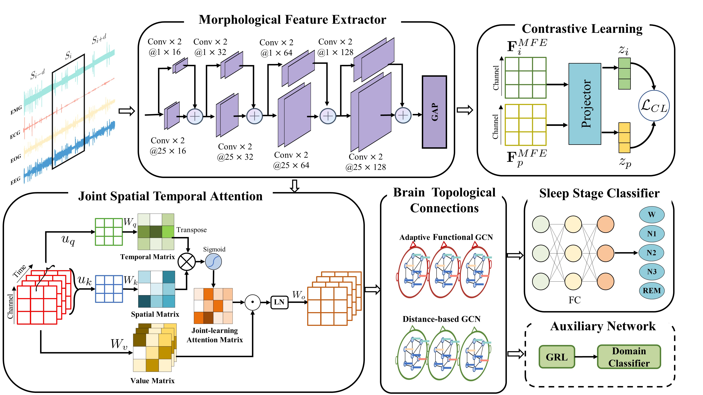

# StAGN
StAGN: Spatial-Temporal Adaptive Graph Network via Constranstive Learning for Sleep Stage Classification, which is improved from [MSTGCN](https://github.com/ziyujia/MSTGCN).

## Dataset
The ISRUC dataset can be downloaded from website: https://sleeptight.isr.uc.pt

## Preprocess
Run `preprocess.py`

`python preprocess.py`

## Train model
You can change the input data **path** and run. Note that the output from MFE is the STA_GCN's input.
